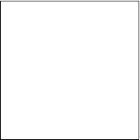
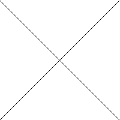
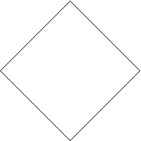
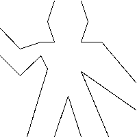

## Exercise 2.49

Full script available as `2-49.scm` so this ran be reproduced in _DrRacket *_.

### Part A - Outline

```
(define outline
  (segments->painter
   (list
    (make-segment (make-vect 0 0) (make-vect 1 0))
    (make-segment (make-vect 1 0) (make-vect 1 1))
    (make-segment (make-vect 1 1) (make-vect 0 1))
    (make-segment (make-vect 0 1) (make-vect 0 0)))))

(paint outline)
```



### Part B - X

```
(define x
  (segments->painter
   (list
    (make-segment (make-vect 0 0) (make-vect 1 1))
    (make-segment (make-vect 0 1) (make-vect 1 0)))))

(paint x)
```



### Part C - Diamond

```
(define diamond
  (segments->painter
   (list
    (make-segment (make-vect 0 0.5) (make-vect 0.5 1))
    (make-segment (make-vect 0.5 1) (make-vect 1 0.5))
    (make-segment (make-vect 1 0.5) (make-vect 0.5 0))
    (make-segment (make-vect 0.5 0) (make-vect 0 0.5)))))

(paint diamond)
```



### Part D - Wave

Note: I had already found a definition of wave online to illustrate exercise 2.44. I won't try to rewrite it again myself, but it's clear how this can be worked out.

You could use trial and error, but a smart way might be to draw out a design on grid paper and count squares from each point to the origin to get the vectors of each segment.

```
(define wave
  (segments->painter
   (list
    (make-segment (make-vect 0.20 0.00) (make-vect 0.35 0.50))
    (make-segment (make-vect 0.35 0.50) (make-vect 0.30 0.60))
    (make-segment (make-vect 0.30 0.60) (make-vect 0.15 0.45))
    (make-segment (make-vect 0.15 0.45) (make-vect 0.00 0.60))
    (make-segment (make-vect 0.00 0.80) (make-vect 0.15 0.65))
    (make-segment (make-vect 0.15 0.65) (make-vect 0.30 0.70))
    (make-segment (make-vect 0.30 0.70) (make-vect 0.40 0.70))
    (make-segment (make-vect 0.40 0.70) (make-vect 0.35 0.85))
    (make-segment (make-vect 0.35 0.85) (make-vect 0.40 1.00))
    (make-segment (make-vect 0.60 1.00) (make-vect 0.65 0.85))
    (make-segment (make-vect 0.65 0.85) (make-vect 0.60 0.70))
    (make-segment (make-vect 0.60 0.70) (make-vect 0.75 0.70))
    (make-segment (make-vect 0.75 0.70) (make-vect 1.00 0.40))
    (make-segment (make-vect 1.00 0.20) (make-vect 0.60 0.48))
    (make-segment (make-vect 0.60 0.48) (make-vect 0.80 0.00))
    (make-segment (make-vect 0.40 0.00) (make-vect 0.50 0.30))
    (make-segment (make-vect 0.50 0.30) (make-vect 0.60 0.00)))))

(paint wave)
```



_* Images saved from running script in DrRacket interpreter and white background added using GIMP._